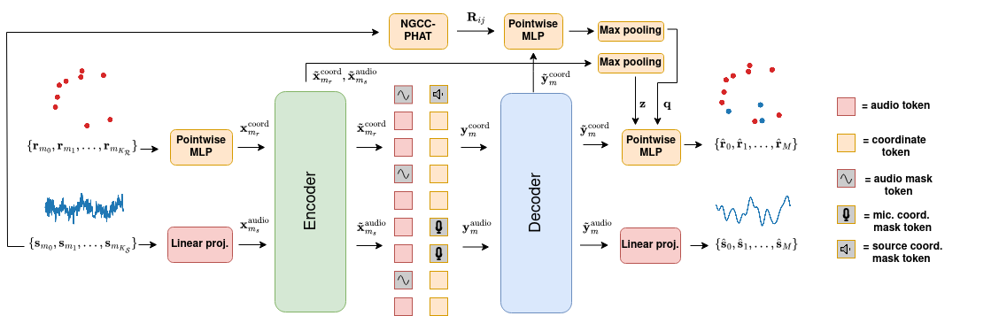

# wav2pos: Sound Source Localization using Masked Autoencoders



This repository contains a reference implementation of [wav2pos](https://arxiv.org/abs/2408.15771), as well as code for training the model for 3D sound source localization on simulated speech data.

Tested using python 3.8 and torch 2.1.

## Data generation and NGCC-PHAT pre-training

For speed, our example only simulates sound propagation in an anechoic room. You can change this by modifying `anechoic_prob` (1 is always anechoic, 0 is always reverberant) and `t60` (the inverval from which the random reverberation coeficcient will be drawn).in the `cfg.py` file. 

Running the following will download the LibriSpeech data, perform acoustic simulations using pyroomacoustics, train NGCC-PHAT and store the model. 

```
python main.py --cfg=cfg --model=ngcc --exp_name=ngcc_anechoic
```

## wav2pos training
We can now train our wav2pos localization model. The pre-trained NGCC-PHAT model will be loaded into wav2pos (with frozen weights) for better localization performance. By default, we  sample 5 or 6 microphones in the random masking, train for 30 epochs and store the predictions on the test set.

```
python main.py --cfg=cfg --model=wav2pos --exp_name=wav2pos_anechoic --load_data --data_path=experiments/ngcc_anechoic
```

## wav2pos inference visualization

After you have trained your model, you can try visualizing evaluations using the provided [notebook](./wav2pos_example.ipynb).

## Citation

If you use this code repository, please cite the following paper:

```
@article{berg2024wav2pos,
  title={wav2pos: Sound Source Localization using Masked Autoencoders},
  author={Berg, Axel and Gulin, Jens and O'Connor, Mark and Zhou, Chuteng and {\AA}str{\"o}m, Karl and Oskarsson, Magnus},
  journal={arXiv preprint arXiv:2408.15771},
  year={2024}
}
```

## Acknowledgements

The model implementation is based on the original masked autoencoder code, which can be found [here](https://github.com/facebookresearch/mae). Consider citing this work as well:

```
@inproceedings{he2022masked,
  title={Masked autoencoders are scalable vision learners},
  author={He, Kaiming and Chen, Xinlei and Xie, Saining and Li, Yanghao and Doll{\'a}r, Piotr and Girshick, Ross},
  booktitle={Proceedings of the IEEE/CVF conference on computer vision and pattern recognition},
  pages={16000--16009},
  year={2022}
}
```
